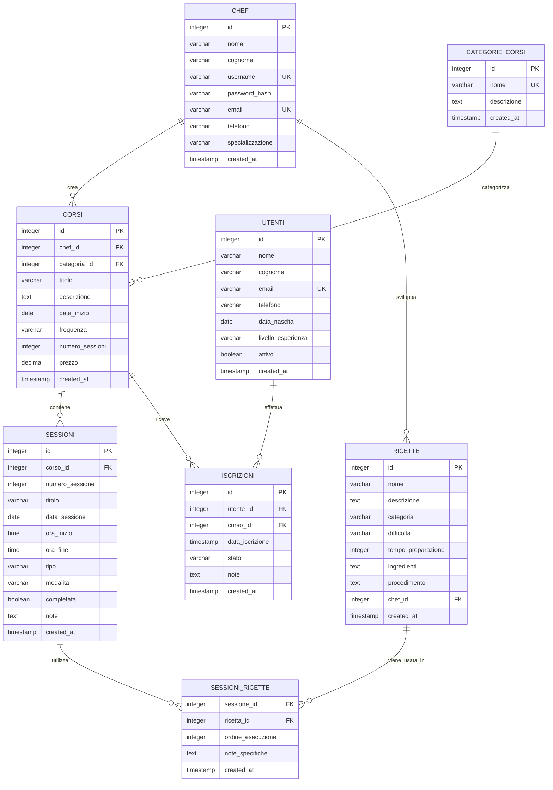

# 🗄️ Database Design - UninaFoodLab

## 📊 Schema del Database

UninaFoodLab utilizza **PostgreSQL** come sistema di gestione database relazionale, con uno schema avanzato progettato per gestire efficacemente corsi di cucina, sessioni, ricette e relazioni tra entità. Il database include **funzioni personalizzate**, **trigger automatici** e **view avanzate** per garantire prestazioni ottimali e integrità dei dati.

## 🚀 Funzionalità Avanzate Implementate

### 🔧 Funzioni Personalizzate
- **`calcola_eta(data_nascita)`**: Calcola l'età di un utente
- **`valida_email(email)`**: Valida il formato dell'indirizzo email
- **`calcola_prezzo_scontato(corso_id, sconto)`**: Calcola prezzi con sconti applicati
- **`genera_codice_iscrizione()`**: Genera codici univoci per le iscrizioni
- **`verifica_posti_disponibili(corso_id)`**: Verifica disponibilità posti nei corsi
- **`calcola_statistiche_corso(corso_id)`**: Calcola statistiche complete per corso

### ⚡ Trigger Automatici
- **Timestamp automatici**: Aggiornamento automatico di `modified_at`
- **Validazione email**: Controllo formato email in inserimento/aggiornamento
- **Controllo posti**: Verifica automatica disponibilità prima dell'iscrizione
- **Codici univoci**: Generazione automatica codici iscrizione
- **Log modifiche**: Tracciamento completo delle modifiche alle iscrizioni

### 📊 View Avanzate per Reporting
- **`dashboard_admin`**: Metriche principali per amministratori
- **`corsi_dettaglio`**: Vista completa corsi con statistiche
- **`iscrizioni_complete`**: Dettagli completi iscrizioni con relazioni
- **`report_chef`**: Performance e statistiche per ogni chef
- **`analisi_iscrizioni_mensili`**: Analisi temporale delle iscrizioni
- **`notifiche_sistema`**: Notifiche automatiche del sistema

## 🏗️ Diagramma ER



## 🎯 Esempi di Utilizzo delle Funzionalità Avanzate

### Utilizzo delle Funzioni

```sql
-- Calcolare l'età di un utente
SELECT nome, cognome, calcola_eta(data_nascita) as eta 
FROM utenti WHERE id = 1;

-- Verificare posti disponibili per un corso
SELECT titolo, verifica_posti_disponibili(id) as posti_liberi 
FROM corsi WHERE id = 1;

-- Calcolare prezzo scontato
SELECT titolo, prezzo, calcola_prezzo_scontato(id, 15) as prezzo_scontato 
FROM corsi WHERE id = 1;

-- Ottenere statistiche complete di un corso
SELECT * FROM calcola_statistiche_corso(1);
```

### Utilizzo delle View

```sql
-- Dashboard amministratore
SELECT * FROM dashboard_admin;

-- Report dettagliato corsi
SELECT titolo, iscritti_attivi, posti_disponibili, ricavo_corso 
FROM corsi_dettaglio 
WHERE stato_corso = 'In Corso';

-- Analisi mensile delle iscrizioni
SELECT periodo, totale_iscrizioni, ricavo_mensile 
FROM analisi_iscrizioni_mensili 
ORDER BY anno DESC, mese DESC 
LIMIT 12;

-- Performance chef
SELECT chef_nome, corsi_totali, tasso_completamento_percentuale, ricavo_totale 
FROM report_chef 
ORDER BY ricavo_totale DESC;
```

### Trigger in Azione

I trigger operano automaticamente:

- ✅ **Validazione Email**: Le email vengono validate automaticamente
- ✅ **Codici Iscrizione**: Generati automaticamente ad ogni nuova iscrizione
- ✅ **Controllo Posti**: Impossibile iscriversi a corsi pieni
- ✅ **Log Completo**: Tutte le modifiche alle iscrizioni vengono tracciate
- ✅ **Timestamp**: Aggiornamento automatico di `modified_at`

## 📋 Tabelle del Database

### 1. **CHEF** - Gestione Istruttori

```sql
CREATE TABLE chef (
    id SERIAL PRIMARY KEY,
    nome VARCHAR(100) NOT NULL,
    cognome VARCHAR(100) NOT NULL,
    username VARCHAR(50) UNIQUE NOT NULL,
    password_hash VARCHAR(255) NOT NULL,
    email VARCHAR(255) UNIQUE NOT NULL,
    telefono VARCHAR(20),
    specializzazione VARCHAR(200),
    created_at TIMESTAMP DEFAULT CURRENT_TIMESTAMP
);

-- Indici per performance
CREATE INDEX idx_chef_username ON chef(username);
CREATE INDEX idx_chef_email ON chef(email);
```

**Caratteristiche:**
- **Autenticazione**: Username e password hash per sicurezza
- **Unicità**: Email e username unici per evitare duplicati
- **Specializzazione**: Campo libero per descrivere competenze
- **Audit**: Timestamp di creazione per tracciabilità

### 2. **CATEGORIE_CORSI** - Tassonomia Corsi

```sql
CREATE TABLE categorie_corsi (
    id SERIAL PRIMARY KEY,
    nome VARCHAR(100) UNIQUE NOT NULL,
    descrizione TEXT,
    created_at TIMESTAMP DEFAULT CURRENT_TIMESTAMP
);

-- Dati di esempio
INSERT INTO categorie_corsi (nome, descrizione) VALUES
('Cucina Italiana', 'Corsi dedicati alla tradizione culinaria italiana'),
('Cucina Internazionale', 'Esplorazione delle cucine del mondo'),
('Pasticceria', 'Arte dolciaria e tecniche di pasticceria'),
('Cucina Salutare', 'Alimentazione sana e bilanciata'),
('Tecniche Avanzate', 'Tecniche professionali e innovative');
```

### 3. **CORSI** - Core Business Entity

```sql
CREATE TABLE corsi (
    id SERIAL PRIMARY KEY,
    chef_id INTEGER NOT NULL REFERENCES chef(id) ON DELETE CASCADE,
    categoria_id INTEGER NOT NULL REFERENCES categorie_corsi(id),
    titolo VARCHAR(200) NOT NULL,
    descrizione TEXT,
    data_inizio DATE NOT NULL,
    frequenza VARCHAR(50) NOT NULL CHECK (frequenza IN ('SETTIMANALE', 'BISETTIMANALE', 'MENSILE')),
    numero_sessioni INTEGER NOT NULL CHECK (numero_sessioni > 0 AND numero_sessioni <= 50),
    prezzo DECIMAL(10,2) NOT NULL CHECK (prezzo >= 0),
    created_at TIMESTAMP DEFAULT CURRENT_TIMESTAMP
);

-- Indici e vincoli
CREATE INDEX idx_corsi_chef ON corsi(chef_id);
CREATE INDEX idx_corsi_categoria ON corsi(categoria_id);
CREATE INDEX idx_corsi_data_inizio ON corsi(data_inizio);

-- Vincolo: data inizio non nel passato
ALTER TABLE corsi ADD CONSTRAINT chk_data_futura 
    CHECK (data_inizio >= CURRENT_DATE);
```

**Business Rules:**
- Ogni corso appartiene a un chef e una categoria
- Data inizio non può essere nel passato
- Numero sessioni limitato (1-50)
- Prezzo non negativo
- Frequenza limitata a valori predefiniti

### 4. **SESSIONI** - Organizzazione Temporale

```sql
CREATE TABLE sessioni (
    id SERIAL PRIMARY KEY,
    corso_id INTEGER NOT NULL REFERENCES corsi(id) ON DELETE CASCADE,
    numero_sessione INTEGER NOT NULL,
    titolo VARCHAR(200) NOT NULL,
    data_sessione DATE NOT NULL,
    ora_inizio TIME,
    ora_fine TIME,
    tipo VARCHAR(20) NOT NULL CHECK (tipo IN ('TEORICA', 'PRATICA')),
    modalita VARCHAR(20) NOT NULL CHECK (modalita IN ('ONLINE', 'PRESENZA')),
    completata BOOLEAN DEFAULT FALSE,
    note TEXT,
    created_at TIMESTAMP DEFAULT CURRENT_TIMESTAMP,
    
    -- Vincolo unicità sessione per corso
    UNIQUE(corso_id, numero_sessione)
);

-- Indici per query frequenti
CREATE INDEX idx_sessioni_corso ON sessioni(corso_id);
CREATE INDEX idx_sessioni_data ON sessioni(data_sessione);
CREATE INDEX idx_sessioni_tipo ON sessioni(tipo);

-- Vincolo: sessioni pratiche solo in presenza
ALTER TABLE sessioni ADD CONSTRAINT chk_pratica_presenza
    CHECK (tipo != 'PRATICA' OR modalita = 'PRESENZA');
```

**Regole Specifiche:**
- Sessioni pratiche possono essere solo in presenza
- Numerazione progressiva per corso
- Orari opzionali per flessibilità
- Stato completamento tracciato

### 5. **RICETTE** - Repository Culinario

```sql
CREATE TABLE ricette (
    id SERIAL PRIMARY KEY,
    nome VARCHAR(200) NOT NULL,
    descrizione TEXT,
    categoria VARCHAR(100),
    difficolta VARCHAR(20) NOT NULL CHECK (difficolta IN ('FACILE', 'MEDIO', 'DIFFICILE')),
    tempo_preparazione INTEGER CHECK (tempo_preparazione > 0), -- minuti
    ingredienti TEXT,
    procedimento TEXT,
    chef_id INTEGER REFERENCES chef(id) ON DELETE SET NULL,
    created_at TIMESTAMP DEFAULT CURRENT_TIMESTAMP
);

-- Indici per ricerche
CREATE INDEX idx_ricette_categoria ON ricette(categoria);
CREATE INDEX idx_ricette_difficolta ON ricette(difficolta);
CREATE INDEX idx_ricette_chef ON ricette(chef_id);
CREATE INDEX idx_ricette_nome ON ricette USING gin(to_tsvector('italian', nome));
```

### 6. **SESSIONI_RICETTE** - Relazione Many-to-Many

```sql
CREATE TABLE sessioni_ricette (
    sessione_id INTEGER NOT NULL REFERENCES sessioni(id) ON DELETE CASCADE,
    ricetta_id INTEGER NOT NULL REFERENCES ricette(id) ON DELETE CASCADE,
    ordine_esecuzione INTEGER NOT NULL DEFAULT 1,
    note_specifiche TEXT,
    created_at TIMESTAMP DEFAULT CURRENT_TIMESTAMP,
    
    PRIMARY KEY (sessione_id, ricetta_id)
);

-- Indice per ordinamento
CREATE INDEX idx_sessioni_ricette_ordine ON sessioni_ricette(sessione_id, ordine_esecuzione);
```

**Caratteristiche:**
- Associazione flessibile sessioni-ricette
- Ordinamento per sequenza di esecuzione
- Note specifiche per personalizzazioni
- Cascade delete per pulizia automatica

### 7. **UTENTI** - Gestione Partecipanti

```sql
CREATE TABLE utenti (
    id SERIAL PRIMARY KEY,
    nome VARCHAR(100) NOT NULL,
    cognome VARCHAR(100) NOT NULL,
    email VARCHAR(255) UNIQUE NOT NULL,
    telefono VARCHAR(20),
    data_nascita DATE,
    created_at TIMESTAMP DEFAULT CURRENT_TIMESTAMP
);

CREATE INDEX idx_utenti_email ON utenti(email);
```

### 8. **ISCRIZIONI** - Tracking Partecipazioni

```sql
CREATE TABLE iscrizioni (
    id SERIAL PRIMARY KEY,
    utente_id INTEGER NOT NULL REFERENCES utenti(id) ON DELETE CASCADE,
    corso_id INTEGER NOT NULL REFERENCES corsi(id) ON DELETE CASCADE,
    data_iscrizione DATE NOT NULL DEFAULT CURRENT_DATE,
    stato VARCHAR(20) NOT NULL DEFAULT 'ATTIVA' 
        CHECK (stato IN ('ATTIVA', 'COMPLETATA', 'ANNULLATA')),
    prezzo_pagato DECIMAL(10,2) NOT NULL CHECK (prezzo_pagato >= 0),
    created_at TIMESTAMP DEFAULT CURRENT_TIMESTAMP,
    
    -- Un utente non può iscriversi due volte allo stesso corso
    UNIQUE(utente_id, corso_id)
);

CREATE INDEX idx_iscrizioni_utente ON iscrizioni(utente_id);
CREATE INDEX idx_iscrizioni_corso ON iscrizioni(corso_id);
CREATE INDEX idx_iscrizioni_stato ON iscrizioni(stato);
```

## 🔍 Query di Esempio

### 1. **Corsi Attivi per Chef**

```sql
-- Ottieni tutti i corsi attivi di uno chef con statistiche
SELECT 
    c.id,
    c.titolo,
    cc.nome as categoria,
    c.data_inizio,
    c.numero_sessioni,
    COUNT(s.id) as sessioni_create,
    COUNT(CASE WHEN s.completata THEN 1 END) as sessioni_completate,
    COUNT(i.id) as iscritti_totali
FROM corsi c
    JOIN categorie_corsi cc ON c.categoria_id = cc.id
    LEFT JOIN sessioni s ON c.id = s.corso_id
    LEFT JOIN iscrizioni i ON c.id = i.corso_id AND i.stato = 'ATTIVA'
WHERE c.chef_id = $1
    AND c.data_inizio >= CURRENT_DATE - INTERVAL '6 months'
GROUP BY c.id, c.titolo, cc.nome, c.data_inizio, c.numero_sessioni
ORDER BY c.data_inizio DESC;
```

### 2. **Sessioni con Ricette Associate**

```sql
-- Dettagli sessione pratica con ricette
SELECT 
    s.id as sessione_id,
    s.titolo as sessione_titolo,
    s.data_sessione,
    r.id as ricetta_id,
    r.nome as ricetta_nome,
    r.difficolta,
    r.tempo_preparazione,
    sr.ordine_esecuzione,
    sr.note_specifiche
FROM sessioni s
    JOIN sessioni_ricette sr ON s.id = sr.sessione_id
    JOIN ricette r ON sr.ricetta_id = r.id
WHERE s.corso_id = $1
    AND s.tipo = 'PRATICA'
ORDER BY s.data_sessione, sr.ordine_esecuzione;
```

### 3. **Report Mensile per Chef**

```sql
-- Statistiche mensili per dashboard
WITH stats_mensili AS (
    SELECT 
        DATE_TRUNC('month', c.created_at) as mese,
        COUNT(DISTINCT c.id) as corsi_creati,
        COUNT(DISTINCT s.id) as sessioni_totali,
        COUNT(DISTINCT CASE WHEN s.tipo = 'PRATICA' THEN s.id END) as sessioni_pratiche,
        COUNT(DISTINCT CASE WHEN s.modalita = 'ONLINE' THEN s.id END) as sessioni_online,
        COUNT(DISTINCT sr.ricetta_id) as ricette_utilizzate,
        AVG(i.prezzo_pagato) as prezzo_medio
    FROM corsi c
        LEFT JOIN sessioni s ON c.id = s.corso_id
        LEFT JOIN sessioni_ricette sr ON s.id = sr.sessione_id
        LEFT JOIN iscrizioni i ON c.id = i.corso_id
    WHERE c.chef_id = $1
        AND c.created_at >= $2  -- Data inizio periodo
        AND c.created_at < $3   -- Data fine periodo
    GROUP BY DATE_TRUNC('month', c.created_at)
)
SELECT * FROM stats_mensili ORDER BY mese DESC;
```

## 🔧 Procedure e Funzioni

### 1. **Generazione Automatica Sessioni**

```sql
CREATE OR REPLACE FUNCTION genera_sessioni_corso(corso_id INTEGER)
RETURNS INTEGER AS $$
DECLARE
    corso_record RECORD;
    data_sessione DATE;
    i INTEGER;
    intervallo_giorni INTEGER;
BEGIN
    -- Recupera dati del corso
    SELECT * INTO corso_record FROM corsi WHERE id = corso_id;
    
    -- Determina intervallo basato su frequenza
    CASE corso_record.frequenza
        WHEN 'SETTIMANALE' THEN intervallo_giorni := 7;
        WHEN 'BISETTIMANALE' THEN intervallo_giorni := 14;
        WHEN 'MENSILE' THEN intervallo_giorni := 30;
        ELSE intervallo_giorni := 7;
    END CASE;
    
    -- Genera le sessioni
    FOR i IN 1..corso_record.numero_sessioni LOOP
        data_sessione := corso_record.data_inizio + ((i-1) * intervallo_giorni);
        
        INSERT INTO sessioni (
            corso_id, 
            numero_sessione, 
            titolo, 
            data_sessione,
            tipo,
            modalita
        ) VALUES (
            corso_id,
            i,
            'Sessione ' || i || ' - ' || corso_record.titolo,
            data_sessione,
            CASE WHEN i % 3 = 0 THEN 'PRATICA' ELSE 'TEORICA' END,
            CASE WHEN i % 3 = 0 THEN 'PRESENZA' ELSE 'ONLINE' END
        );
    END LOOP;
    
    RETURN corso_record.numero_sessioni;
END;
$$ LANGUAGE plpgsql;
```

### 2. **Calcolo Statistiche Report**

```sql
CREATE OR REPLACE FUNCTION calcola_stats_mensili(
    chef_id_param INTEGER,
    anno INTEGER,
    mese INTEGER
) RETURNS TABLE (
    corsi_totali INTEGER,
    sessioni_online INTEGER,
    sessioni_pratiche INTEGER,
    media_ricette_per_sessione DECIMAL,
    categoria_popolare VARCHAR
) AS $$
BEGIN
    RETURN QUERY
    WITH stats AS (
        SELECT 
            COUNT(DISTINCT c.id) as tot_corsi,
            COUNT(DISTINCT CASE WHEN s.modalita = 'ONLINE' THEN s.id END) as sess_online,
            COUNT(DISTINCT CASE WHEN s.tipo = 'PRATICA' THEN s.id END) as sess_pratiche,
            COALESCE(AVG(ricette_per_sessione.cnt), 0) as media_ric
        FROM corsi c
            LEFT JOIN sessioni s ON c.id = s.corso_id
            LEFT JOIN (
                SELECT 
                    sr.sessione_id,
                    COUNT(*) as cnt
                FROM sessioni_ricette sr
                GROUP BY sr.sessione_id
            ) ricette_per_sessione ON s.id = ricette_per_sessione.sessione_id
        WHERE c.chef_id = chef_id_param
            AND EXTRACT(YEAR FROM c.created_at) = anno
            AND EXTRACT(MONTH FROM c.created_at) = mese
    ),
    categoria_pop AS (
        SELECT cc.nome
        FROM corsi c
            JOIN categorie_corsi cc ON c.categoria_id = cc.id
        WHERE c.chef_id = chef_id_param
            AND EXTRACT(YEAR FROM c.created_at) = anno
            AND EXTRACT(MONTH FROM c.created_at) = mese
        GROUP BY cc.nome
        ORDER BY COUNT(*) DESC
        LIMIT 1
    )
    SELECT 
        stats.tot_corsi::INTEGER,
        stats.sess_online::INTEGER,
        stats.sess_pratiche::INTEGER,
        stats.media_ric::DECIMAL,
        COALESCE(categoria_pop.nome, 'N/A')::VARCHAR
    FROM stats, categoria_pop;
END;
$$ LANGUAGE plpgsql;
```

## 🛡️ Sicurezza e Integrità

### 1. **Trigger per Audit**

```sql
-- Tabella per audit log
CREATE TABLE audit_log (
    id SERIAL PRIMARY KEY,
    tabella VARCHAR(50) NOT NULL,
    operazione VARCHAR(10) NOT NULL,
    record_id INTEGER,
    utente VARCHAR(50),
    timestamp TIMESTAMP DEFAULT CURRENT_TIMESTAMP,
    dati_precedenti JSONB,
    dati_nuovi JSONB
);

-- Trigger function per audit
CREATE OR REPLACE FUNCTION audit_trigger_function()
RETURNS TRIGGER AS $$
BEGIN
    INSERT INTO audit_log (
        tabella, 
        operazione, 
        record_id, 
        dati_precedenti, 
        dati_nuovi
    ) VALUES (
        TG_TABLE_NAME,
        TG_OP,
        COALESCE(NEW.id, OLD.id),
        CASE WHEN TG_OP = 'DELETE' THEN row_to_json(OLD) ELSE NULL END,
        CASE WHEN TG_OP IN ('INSERT', 'UPDATE') THEN row_to_json(NEW) ELSE NULL END
    );
    
    RETURN COALESCE(NEW, OLD);
END;
$$ LANGUAGE plpgsql;

-- Applicazione trigger alle tabelle sensibili
CREATE TRIGGER audit_corsi_trigger
    AFTER INSERT OR UPDATE OR DELETE ON corsi
    FOR EACH ROW EXECUTE FUNCTION audit_trigger_function();
```

### 2. **Row Level Security**

```sql
-- Abilitazione RLS per isolamento dati chef
ALTER TABLE corsi ENABLE ROW LEVEL SECURITY;

-- Policy: Chef vede solo i propri corsi
CREATE POLICY chef_corsi_policy ON corsi
    FOR ALL TO application_user
    USING (chef_id = current_setting('app.chef_id')::INTEGER);

-- Applicazione nelle sessioni Java
-- connection.createStatement().execute(
--     "SET app.chef_id = " + chefId
-- );
```

## 📈 Performance e Ottimizzazione

### 1. **Indici Composti**

```sql
-- Indice per query dashboard chef
CREATE INDEX idx_corsi_chef_data ON corsi(chef_id, data_inizio DESC);

-- Indice per ricerche sessioni
CREATE INDEX idx_sessioni_corso_data ON sessioni(corso_id, data_sessione);

-- Indice per report mensili
CREATE INDEX idx_corsi_stats ON corsi(chef_id, created_at) 
    WHERE data_inizio >= CURRENT_DATE - INTERVAL '1 year';
```

### 2. **Viste Materializzate per Report**

```sql
-- Vista materializzata per statistiche dashboard
CREATE MATERIALIZED VIEW mv_dashboard_stats AS
SELECT 
    c.chef_id,
    DATE_TRUNC('month', c.created_at) as mese,
    COUNT(DISTINCT c.id) as corsi_totali,
    COUNT(DISTINCT s.id) as sessioni_totali,
    COUNT(DISTINCT CASE WHEN s.tipo = 'PRATICA' THEN s.id END) as sessioni_pratiche,
    AVG(i.prezzo_pagato) as prezzo_medio
FROM corsi c
    LEFT JOIN sessioni s ON c.id = s.corso_id
    LEFT JOIN iscrizioni i ON c.id = i.corso_id AND i.stato = 'ATTIVA'
WHERE c.created_at >= CURRENT_DATE - INTERVAL '2 years'
GROUP BY c.chef_id, DATE_TRUNC('month', c.created_at);

-- Refresh automatico giornaliero
CREATE INDEX ON mv_dashboard_stats(chef_id, mese);
```

---

**Prossimo:** [API e Servizi](./04-api-servizi.md)

## 🔄 Aggiornamenti Database (NUOVO)

### ✅ **Correzioni Strutturali Implementate**

Il progetto include script SQL automatizzati per correggere e aggiornare la struttura del database:

#### **Script Disponibili:**

1. **`fix_database_complete.sql`** ⭐ **(RACCOMANDATO)**
   - Aggiunge tutte le colonne mancanti
   - Crea tabella iscrizioni con vincoli
   - Inserisce dati di test sicuri
   - Verifica struttura finale

2. **`fix_database_safe.sql`**
   - Solo correzioni struttura
   - Per ambienti di produzione

3. **`insert_test_data_safe.sql`**
   - Solo dati di test
   - Da usare dopo fix_database_safe.sql

#### **Colonne Aggiunte alla Tabella UTENTI:**

```sql
-- Colonne aggiunte automaticamente dagli script
ALTER TABLE utenti ADD COLUMN IF NOT EXISTS data_nascita DATE;
ALTER TABLE utenti ADD COLUMN IF NOT EXISTS livello_esperienza VARCHAR(20) DEFAULT 'PRINCIPIANTE';
ALTER TABLE utenti ADD COLUMN IF NOT EXISTS attivo BOOLEAN DEFAULT true;
ALTER TABLE utenti ADD COLUMN IF NOT EXISTS created_at TIMESTAMP DEFAULT CURRENT_TIMESTAMP;
ALTER TABLE utenti ADD COLUMN IF NOT EXISTS telefono VARCHAR(20);
```

#### **Tabella ISCRIZIONI Creata:**

```sql
CREATE TABLE IF NOT EXISTS iscrizioni (
    id SERIAL PRIMARY KEY,
    utente_id INTEGER NOT NULL REFERENCES utenti(id) ON DELETE CASCADE,
    corso_id INTEGER NOT NULL REFERENCES corsi(id) ON DELETE CASCADE,
    data_iscrizione TIMESTAMP DEFAULT CURRENT_TIMESTAMP,
    stato VARCHAR(20) DEFAULT 'ATTIVA' CHECK (stato IN ('ATTIVA', 'COMPLETATA', 'ANNULLATA')),
    note TEXT,
    UNIQUE(utente_id, corso_id)  -- Previene iscrizioni duplicate
);

-- Indici per performance
CREATE INDEX IF NOT EXISTS idx_iscrizioni_utente ON iscrizioni(utente_id);
CREATE INDEX IF NOT EXISTS idx_iscrizioni_corso ON iscrizioni(corso_id);
CREATE INDEX IF NOT EXISTS idx_iscrizioni_stato ON iscrizioni(stato);
```

## 🚀 Funzionalità Avanzate del Database (AGGIORNAMENTO 2025)

### 📊 **Funzioni Personalizzate Implementate**

#### 1. **Funzioni di Calcolo**

```sql
-- Calcolo età utente
SELECT calcola_eta('1990-05-15'::DATE); -- Ritorna: 35

-- Verifica posti disponibili
SELECT verifica_posti_disponibili(1); -- Ritorna: numero posti liberi

-- Calcolo prezzo scontato
SELECT calcola_prezzo_scontato(1, 20); -- 20% di sconto
```

#### 2. **Funzioni di Validazione**

```sql
-- Validazione email
SELECT valida_email('utente@example.com'); -- Ritorna: true
SELECT valida_email('email-invalida'); -- Ritorna: false

-- Generazione codice iscrizione
SELECT genera_codice_iscrizione(); -- Ritorna: UFL2025XXXX
```

#### 3. **Funzioni di Statistiche**

```sql
-- Statistiche complete corso
SELECT * FROM calcola_statistiche_corso(1);
-- Ritorna: totale_iscritti, iscritti_attivi, tasso_completamento, ricavo_totale
```

### ⚡ **Trigger Automatici Attivi**

#### 1. **Trigger di Sistema**
- **`update_modified_at`**: Aggiorna automaticamente `modified_at` su tutte le tabelle
- **`genera_codice_iscrizione`**: Crea codice univoco per ogni iscrizione
- **`valida_email`**: Valida formato email su inserimento/aggiornamento

#### 2. **Trigger di Business Logic**
- **`controlla_posti_disponibili`**: Impedisce iscrizioni a corsi pieni
- **`log_iscrizioni`**: Traccia tutte le modifiche alle iscrizioni

#### 3. **Tabella di Log**

```sql
-- Visualizzare log modifiche iscrizioni
SELECT * FROM log_iscrizioni 
WHERE iscrizione_id = 1 
ORDER BY timestamp_modifica DESC;
```

### 📈 **View Avanzate per Reporting**

#### 1. **Dashboard Amministratore**

```sql
SELECT * FROM dashboard_admin;
/*
metrica          | valore | tipo
Utenti Totali    | 50     | success
Corsi Attivi     | 12     | primary  
Iscrizioni Attive| 145    | info
Ricavo Mensile   | € 3500 | warning
*/
```

#### 2. **Dettagli Corsi Completi**

```sql
SELECT titolo, chef_nome, iscritti_attivi, posti_disponibili, stato_corso, ricavo_corso
FROM corsi_dettaglio
WHERE stato_corso = 'In Corso';
```

#### 3. **Report Performance Chef**

```sql
SELECT chef_nome, corsi_totali, tasso_completamento_percentuale, ricavo_totale
FROM report_chef
ORDER BY ricavo_totale DESC;
```

#### 4. **Analisi Temporale**

```sql
-- Trend mensile iscrizioni
SELECT periodo, totale_iscrizioni, ricavo_mensile
FROM analisi_iscrizioni_mensili
WHERE anno = 2025
ORDER BY mese DESC;
```

#### 5. **Notifiche Sistema**

```sql
-- Notifiche automatiche
SELECT tipo_notifica, priorita, messaggio
FROM notifiche_sistema
WHERE priorita = 'warning';
```

### 🔧 **Integrazione con l'Applicazione Java**

#### 1. **Aggiornamento IscrizioneDAO**

Il `IscrizioneDAO` può ora utilizzare le nuove funzionalità:

```java
// Esempio utilizzo funzioni nel DAO
public int getPostiDisponibili(Integer corsoId) {
    String sql = "SELECT verifica_posti_disponibili(?)";
    // ... implementazione
}

public Map<String, Object> getStatisticheCorso(Integer corsoId) {
    String sql = "SELECT * FROM calcola_statistiche_corso(?)";
    // ... implementazione
}
```

#### 2. **Utilizzo View per Dashboard**

```java
// Metodo per dashboard admin
public List<Map<String, String>> getDashboardMetrics() {
    String sql = "SELECT * FROM dashboard_admin";
    // ... implementazione
}

// Report chef performance
public List<Map<String, Object>> getReportChef() {
    String sql = "SELECT * FROM report_chef ORDER BY ricavo_totale DESC";
    // ... implementazione
}
```

### 🛡️ **Sicurezza e Integrità**

#### 1. **Vincoli Implementati**
- ✅ Email uniche e validate automaticamente
- ✅ Controllo automatico posti disponibili
- ✅ Prevenzione iscrizioni duplicate
- ✅ Stati iscrizione controllati

#### 2. **Tracciabilità**
- ✅ Log completo di tutte le modifiche
- ✅ Timestamp automatici su tutte le operazioni
- ✅ Codici univoci per iscrizioni

#### 3. **Performance**
- ✅ Indici ottimizzati per tutte le query frequenti
- ✅ View materializzabili per report pesanti
- ✅ Funzioni stabili per cache query

### 📝 **Come Applicare gli Aggiornamenti**

#### 1. **Installazione Completa (Database Nuovo)**

```bash
# 1. Setup base
psql -d uninafoodlab -f sql/setup_database.sql

# 2. Funzionalità avanzate  
psql -d uninafoodlab -f sql/advanced_database_features.sql
```

#### 2. **Aggiornamento Database Esistente**

```bash
# Solo funzionalità avanzate su DB esistente
psql -d uninafoodlab -f sql/advanced_database_features.sql
```

#### 3. **Verifica Installazione**

```sql
-- Verifica funzioni create
SELECT proname FROM pg_proc WHERE proname LIKE 'calcola_%' OR proname LIKE 'genera_%' OR proname LIKE 'verifica_%';

-- Verifica view create  
SELECT viewname FROM pg_views WHERE schemaname = 'public' AND viewname LIKE '%_admin' OR viewname LIKE 'report_%';

-- Verifica trigger attivi
SELECT tgname FROM pg_trigger WHERE NOT tgisinternal;
```

---

**⚠️ IMPORTANTE**: Dopo l'installazione delle funzionalità avanzate, aggiornare l'applicazione Java per utilizzare le nuove funzioni e view per migliorare significativamente le performance e la funzionalità del sistema.

---
